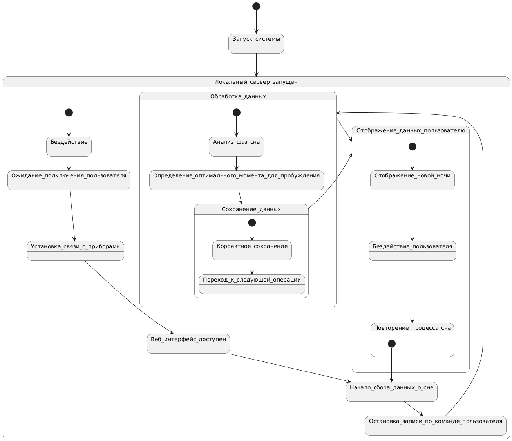
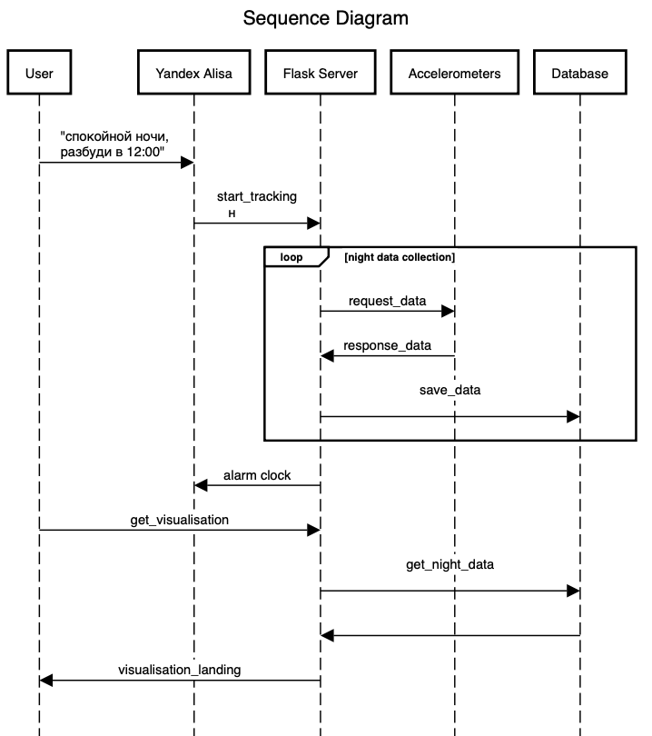
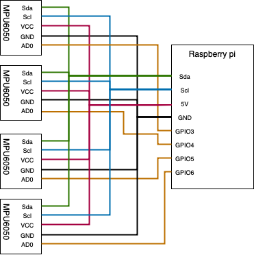

# Описание архитектуры системы

## Список компонентов

- Raspberry Pi 3b
- MPU6050 4 шт

## Используемые языки программирования

- Язык программирования [Python 3.10](https://www.python.org/downloads/release/python-3100/).

## Используемые технологии/библиотеки

- [MicroPython](https://micropython.org/);
- [Flask](https://flask.palletsprojects.com/);
- [React.js](https://react.dev/).

## Описание протоколов передачи данных между элементами

Используется протокол I2C.

Протокол взаимодействия с акселерометрами (по умолчанию на всех входах AD0 низкий сигнал):
1) Установить на входе AD0 нужного акселерометра высокий сигнал
2) Получить показания по протоколу i2c
3) Установить на входе AD0 нужного акселерометра низкий сигнал

## Структура системы

### State диаграмма

## Sequence диаграмма

## Приниципиальная схема

# Команда исполнителей

- Сиразетдинов Азат Ниязович
- Барсуков Максим Андреевич
